# 모아용 API 서버
저축 습관 만들기를 위한 핀테크 프로젝트 '모아용'의 API 서버

---

## 목차
1. [모아용 프로젝트 소개](#1-모아용-프로젝트-소개)
2. [앱 핵심 기능](#2-앱-핵심-기능-mvp)
3. [ERD](#3-erd)
4. [API 서버 관리](#4-api-서버-관리)
5. [API Document](#5-api-document)
6. [팀원 및 역할](#6-팀원-및-역할)
7. [주요 산출물](#7-주요-산출물)

---

## 1. 모아용 프로젝트 소개
모아용은 출석 체크, 금융 퀴즈, 저축 인증을 통해 포인트를 획득하고, 이를 기반으로 리그에서 경쟁하는 핀테크 서비스입니다. 저축 습관이 부족한 대학생 및 사회초년생들이 소액이라도 꾸준히 저축하는 습관을 형성하도록 돕습니다.

### 목표
- **꾸준한 저축 성공 경험 제공** → 장기적으로 정기예금, 적금 등의 저축 상품 활용 습관 형성

### 개요
- 많은 사람들이 저축을 계획하지만 지속하기 어려움
- 모아용은 사용자의 **일관된 저축 실천**을 지원하며 **경쟁 요소**를 추가해 동기 부여
- 출석 인증, 금융 퀴즈, 저축 인증 기능을 통해 **목표 달성을 도와줌**

[📌 기획 문서](https://plain-cotija-223.notion.site/194d4a0c12da80038a7cfa9346078b55?pvs=4)  
[📌 유저스토리](https://plain-cotija-223.notion.site/19dd4a0c12da80e39d5dcbb55d9638d2?pvs=4)

---

## 2. 앱 핵심 기능 (MVP)

### 회원 관련 기능
|         소셜 로그인          |          온보딩          |            메인            |
|:-------------------------:|:-----------------------:|:---------------------:|
| 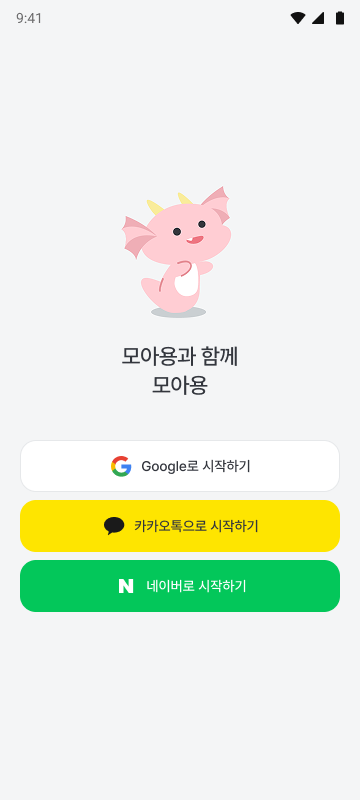 | 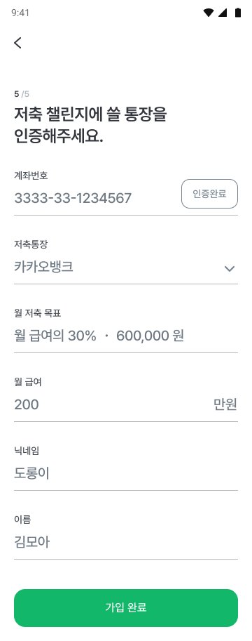 | 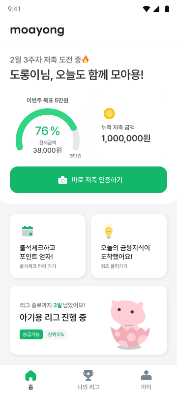 | 

- **OAuth2 로그인 (Spring Security 적용)**
- **JWT + Secure 쿠키 사용**
- **온보딩 미완료 시 Redis 저장, 완료 후 DB 반영**  
[📌 자세한 내용](https://plain-cotija-223.notion.site/1abd4a0c12da804ba74cf110190499d4?pvs=4)

### 출석 기능
|         출석 인증          |          출석 포인트          |            출석 완료            |
|:-------------------------:|:-----------------------:|:---------------------:|
| 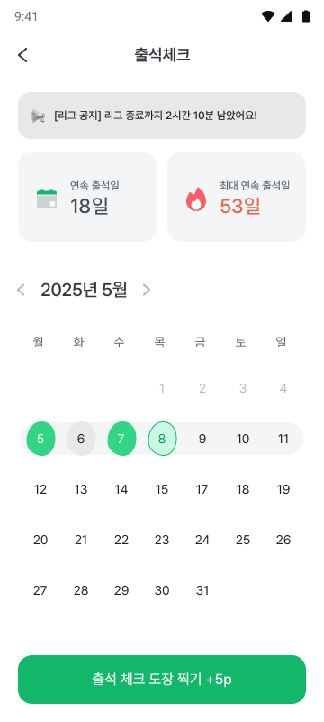 |  | 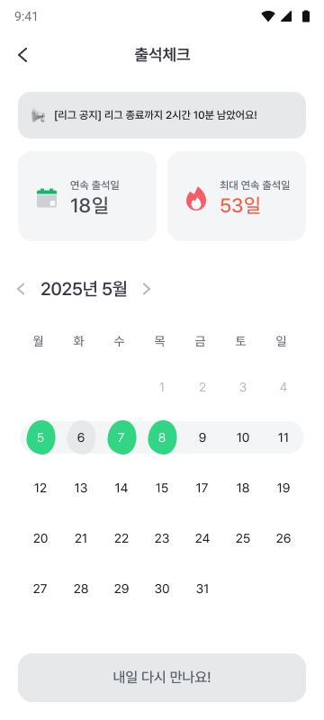 | 

- 매일 출석 체크 시 포인트가 제공됩니다.
- 출석 캘린더, 현재 연속 출석일과 최고 연속 출석일 정보 제공을 통해 꾸준한 출석을 유도합니다.

### 금융 지식 & 퀴즈 기능
|         금융지식 목록          |          오늘의 금융지식          |            금융퀴즈            |
|:-------------------------:|:-----------------------:|:---------------------:|
| 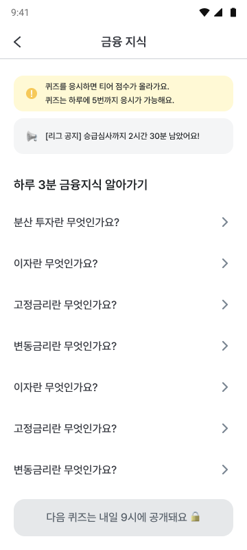 | 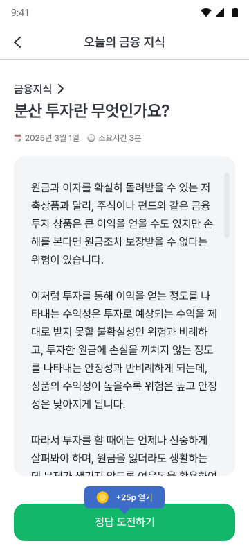 | 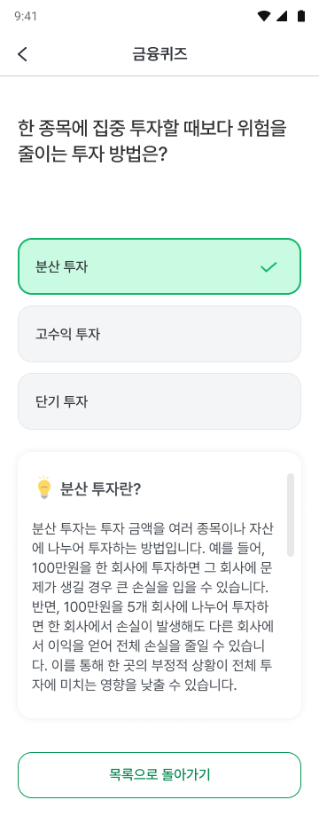 | 

- 금융 개념이 어려운 2030을 위해 **하루 5개의 핵심 금융 개념**을 쉽게 제공합니다.
- 퀴즈 참여 시 포인트를 지급합니다.

### 저축 인증 기능
|        저축인증 메인          |          저축인증하기          |            저축인증 완료            |
|:-------------------------:|:-----------------------:|:---------------------:|
| 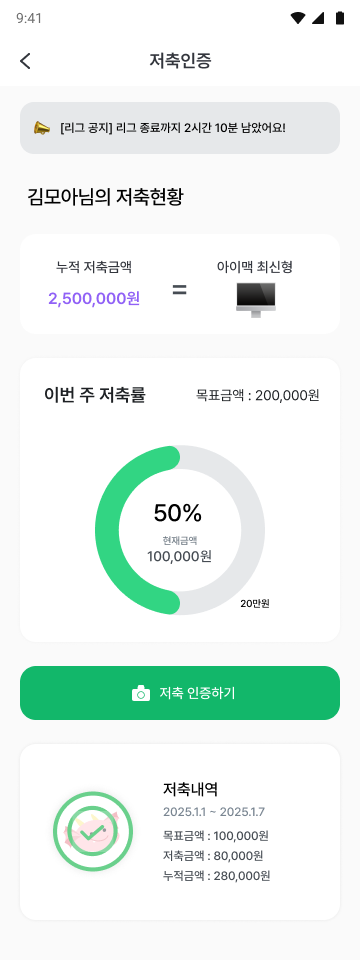 | 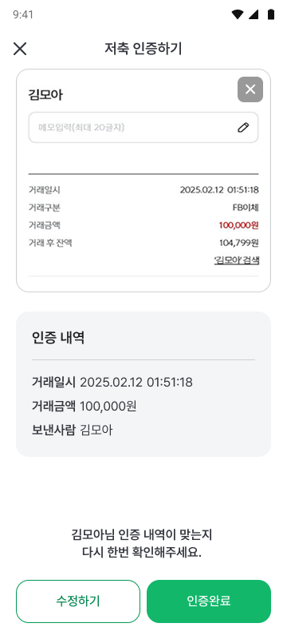 |  | 

- 목표 저축액을 설정하고, 해당 금액을 저축한 후 저축 내역을 캡처하여 인증할 수 있습니다.
- 저축 내역을 인증할 때 OpenCV를 이용해 이미지 전처리 후 Tesseract OCR을 이용하여 인증을 진행합니다.
- 폴링 방식을 통해 비동기로 인증을 진행하며 진행 상황을 Redis에 저장하여 클라이언트에게 전달합니다.
- 이미지는 S3에 업로드되며 클라이언트에게는 CloudFront로 배포된 이미지를 전달합니다.

---

## 3. ERD
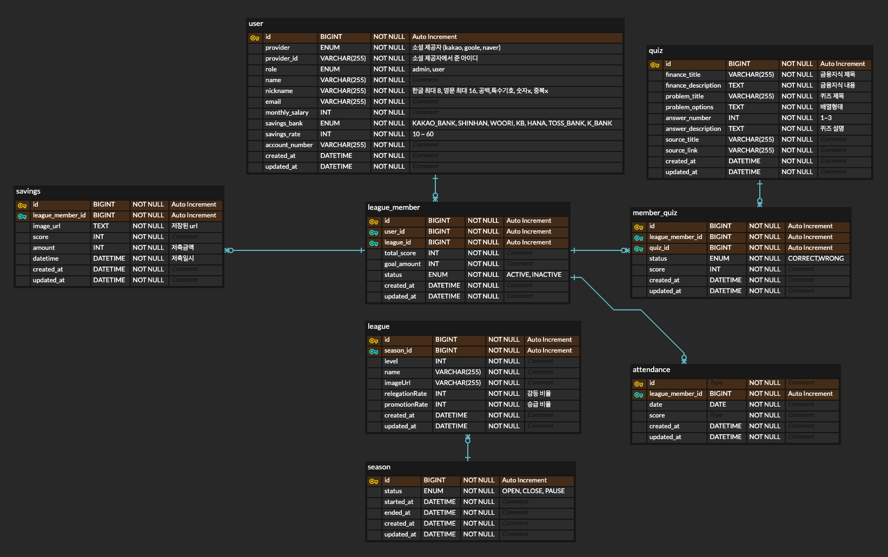
- **시즌 시작 시 티어 기반 리그 생성**
- **이전 시즌 CLOSE 처리, 리그멤버 상태 업데이트**
- **새 시즌 시작 시 새로운 리그 자동 매칭**
- **Redis 캐싱 활용 (퀴즈, 온보딩, OCR 등 실시간 데이터)**

---

## 4. API 서버 관리

- **EC2-1 (운영 서버)**: Docker Compose로 Spring Boot, Redis, MySQL, Nginx 실행
- **EC2-2 (Jenkins CI/CD 서버)**: 자동 빌드 및 배포
- **S3 + CloudFront**: 이미지 저장 및 배포

### 배포 방식
- **Docker Hub 버전 관리**
- **Jenkins 기반 CI/CD 자동화**
- **Blue-Green 무중단 배포**

### 배포 플로우
1. 개발자가 Github main branch에 코드 push
2. Jenkins가 변경 감지 후 빌드 & Docker 이미지 생성
3. Docker Hub에 Push 후 EC2-1에서 Green 컨테이너 실행
4. Nginx가 트래픽을 기존 Blue → Green으로 변경
5. 문제 없으면 기존 Blue 컨테이너 종료
[📌 자세한 설정 및 코드](https://plain-cotija-223.notion.site/1a1d4a0c12da80f5aa25fd9ebd5c9626?pvs=4)

---

## 5. API Document
[📌 API 문서](https://plain-cotija-223.notion.site/API-reference-194d4a0c12da80ed85b7e1ad1125cf05?pvs=4)

---

## 6. 팀원 및 역할
- **팀장:** 이태형 (백엔드)
- **부팀장:** 이수연 (디자인)
- **PM:** 이수연, 안소현
- **디자인:** 권가은
- **백엔드:** 강문영
- **프론트엔드:** 최석호

---

## 7. 주요 산출물
- [📌 노션 문서](https://plain-cotija-223.notion.site/192d4a0c12da808780c8cec29b7721c5?pvs=4)
- 추가 예정
